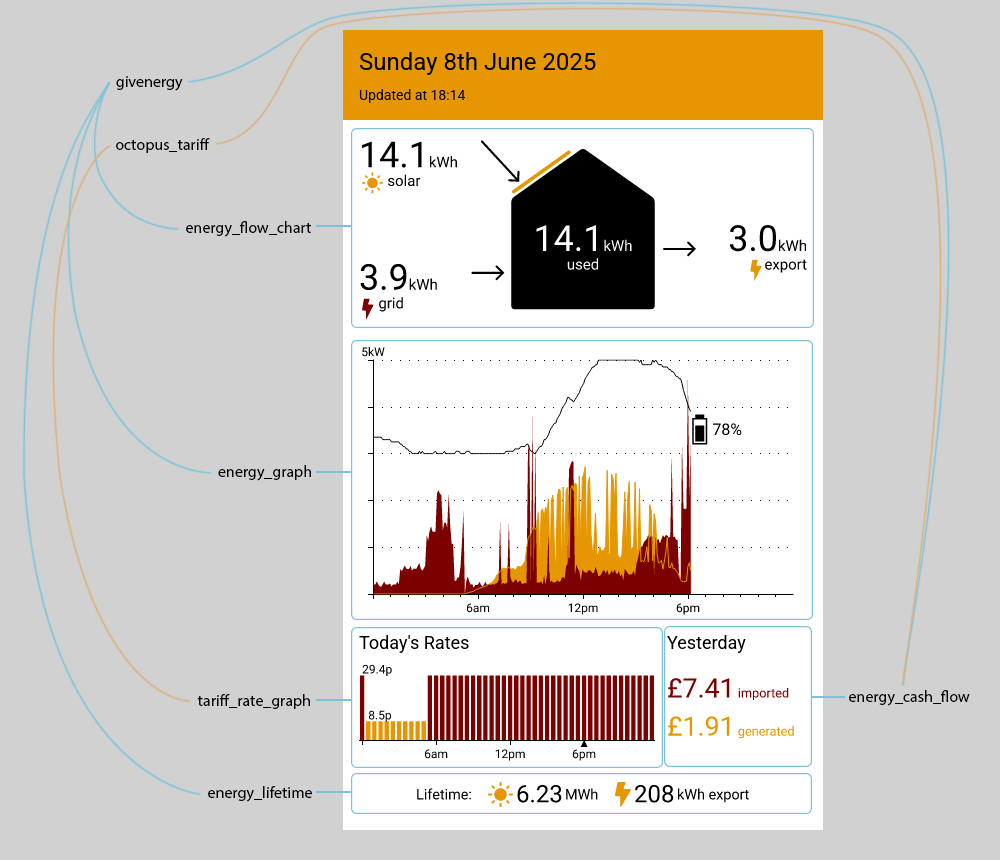

This repository contains a set of Components which can be used to create energy dashboards using [Slipway](https://slipway.co/):



For example usage see [the supplied Rig](rigs/energy_dashboard.json), and [this blog post](https://slipway.co/blog/eink-energy-dashboard).

If you have the following environment variables populated:

- `GIVENERGY_API_TOKEN`
- `GIVENERGY_INVERTER_ID`
- `OCTOPUS_API_TOKEN`
- `OCTOPUS_ACCOUNT_NUMBER`

Then you should be able to run:
```
slipway serve . add-api-key
```

Make a note of the API key in the terminal and then run:
```
slipway serve .
```

And navigate to:

```
http://localhost:8080/rigs/energy_dashboard&authorization=<API_KEY>
```

Where `<API_KEY>` is the API key you noted down above.
You should see the example rig rendered with your data.

If you don't use GivEnergy and Octopus then you'll need to use your own data providers
and replace `jamesthurley.energy_dashboard__octopus` and `jamesthurley.energy_dashboard__givenergy`
with your own versions (or a version written by the community) in the Rig.
